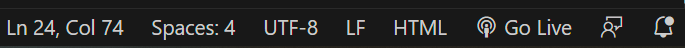
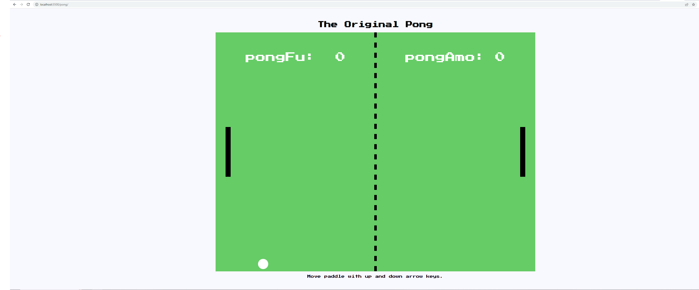
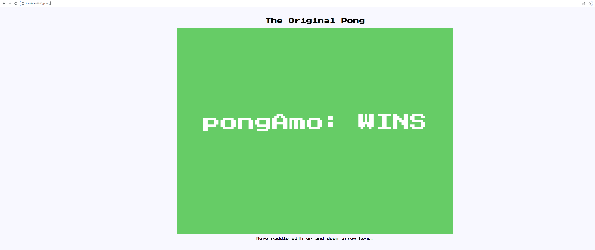

# The Original Pong :video_game:

Welcome to the original Pong game! Experience the thrill of the classic arcade game right in your browser.

## Dev Notes :memo:

### Setup and Run :rocket:

1. Install the `Live Server` extension in VSCode.

2. Navigate to the `./pong` directory in the VSCode terminal.

3. Compile from the `./pong` directory with the command:
    ```bash
    $ tsc
    ```

4. Click the 'Go Live' button on the lower right of VSCode.

    

5. Open your browser and enter the following URL:

    ```
    http://localhost:5500/pong/
    ```

### Controls :joystick:

- Control the left paddle with the  and  keys.
  
- Control the right paddle with the  and  keys.

## Screenshots :camera:




